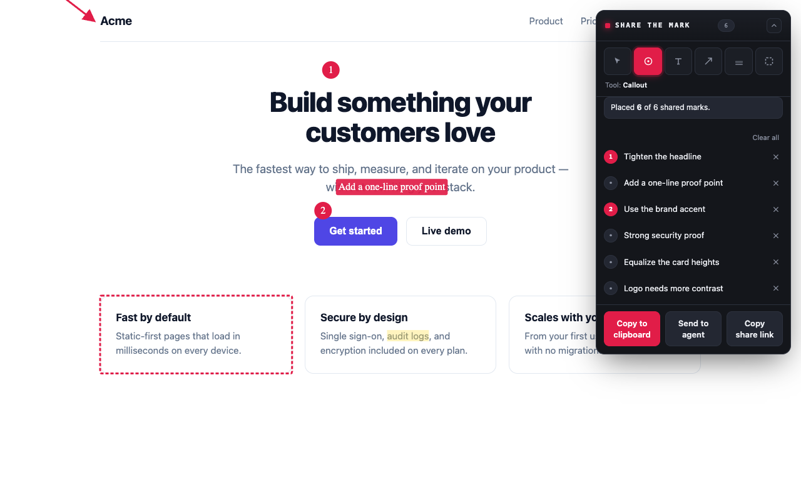
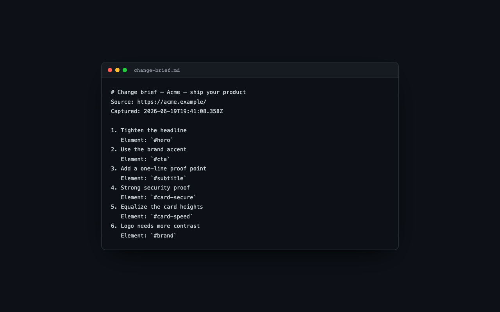

Activate annotation mode on any page and mark it up with five focused tools —
**callout** (auto-numbered marker), **text**, **arrow**, **highlight** (a real
text-selection highlight), and **element** (select a whole element and comment on
it, for design feedback).

Every annotation is **content-anchored** using the W3C Web Annotation model
(Hypothesis-style text selectors): a text-position offset plus a text-quote with
surrounding context, scoped to a verified-unique element selector. Resolution
falls back from position to a fuzzy quote match, so marks track the content as the
page scrolls, resizes, reflows, or re-renders — not just on resize. A live
changelog panel tracks every marker; you can switch tools, edit notes, and delete
markers (callouts renumber automatically).



## Export: Markdown + screenshot

On export, the extension composites the annotations onto a screenshot and writes
**both** a Markdown changelog (`text/plain`) and the annotated PNG (`image/png`) to
the clipboard as a single item. The Markdown is stable and agent-friendly:

```text
# Change brief — Example page
Source: https://example.com/page
Captured: 2026-06-17T00:00:00.000Z

1. Fix the heading copy
   Element: `#hero h1`
2. Remove this banner
   Element: `[data-testid="promo"]`
```



## Share without a screenshot

You can also **Copy share link** — a compact token of just the annotations (no
screenshot). Paste it to a teammate; when they open it, the extension reopens the
page and redraws the marks against the live content, so a review travels across
machines without a screenshot ever leaving anyone's device.

## Status

**Shipped:** the annotation core (five drawing tools plus a select tool,
content-anchored selectors, the in-page changelog panel, screenshot capture +
compositing, clipboard export, per-tab/URL persistence, options page); **agent
integration** through the local `share-the-mark` CLI/daemon; and **cross-machine
sharing** via copy-paste share links. The content script is **injected on demand
under `activeTab`**, so the install requests no host access. Deferred: a
`FileSystemSink`, a native side panel, and Firefox e2e — see
[`SPEC.md`](https://github.com/mpecan/share-the-mark/blob/main/SPEC.md).
