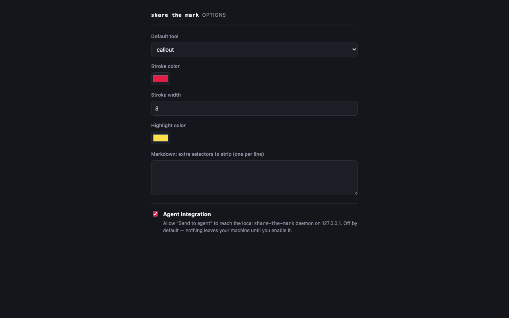

1. Open a normal http(s) page and click the extension icon → **Start annotating**.
   The changelog panel appears on the right.
2. Pick a tool from the palette and mark up the page: click to drop a **callout**
   or place **text** (it prompts for content), drag for an **arrow**, select text
   with the **highlight** tool, or use **element** to hover-and-click a whole
   element and comment on it.
3. Switch to the **Select** tool (the cursor, first in the palette) to edit:
   handles appear on marks and the cursor changes. Drag a callout or text label to
   reposition it, drag an arrow's endpoint handles (or its line) to retarget it,
   drag a highlight's start/end handles to extend or shrink it, and double-click a
   text label to retype it. Dropping a callout, text label, or arrow head over new
   text re-anchors it there.
4. Add notes/comments in the panel; delete markers with ✕.
5. Click **Copy to clipboard** and paste the Markdown + screenshot anywhere, **Copy
   share link** to hand the marks to a teammate on another machine, or **Send to
   agent** to hand the brief to the local `share-the-mark` daemon (see
   [Connect a coding agent](./agent-integration/)).

## Options

The Options page sets your default tool, stroke/highlight colours, theme, and the
**screenshot capture mode** — _Visible area_ (a pixel-perfect screenshot of what's
on screen) or _Full page_ (re-renders the whole scrollable page so an agent gets
the full context, at lower fidelity). It also surfaces copy-paste commands for
installing the CLI.

